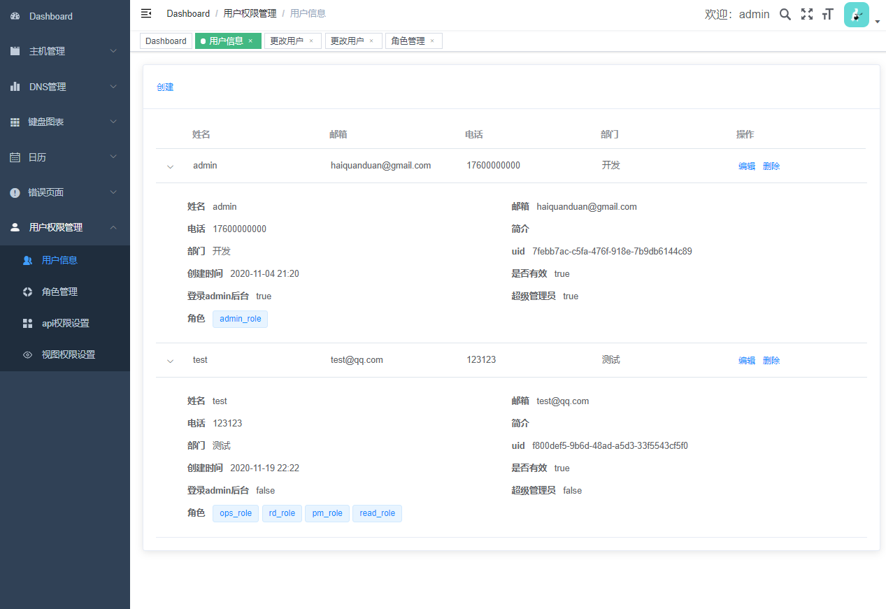
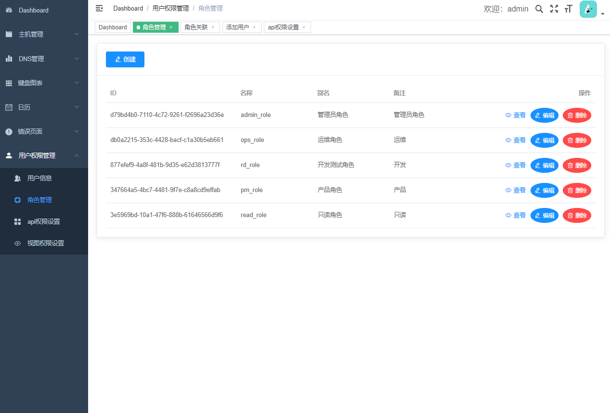
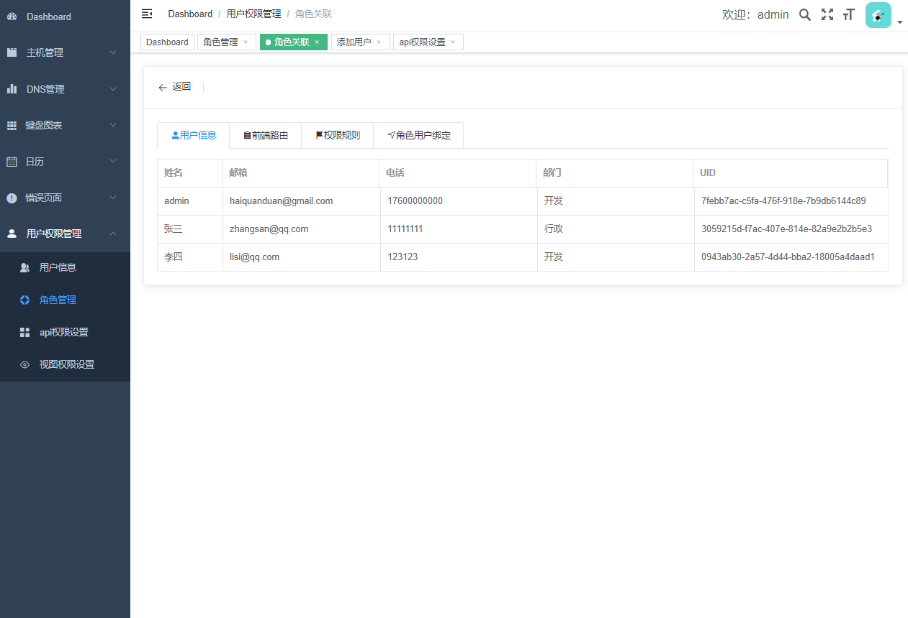
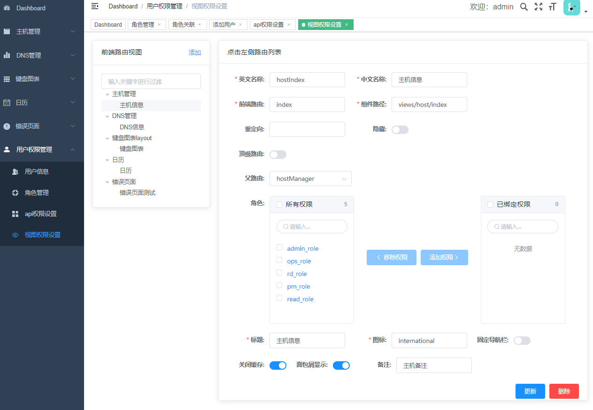

# Django + Vue-element-admin + Casbin 权限系统

## 部署方式
* git clone https://github.com/towithyou/user-manager.git
* 前端
    * cd frontend && npm i 
    * 修改 .env.production 地址改为后端接口地址

* 后端
    * mysql 5.7 +
    * Django==2.2
    * 部署完后执行setup_data.py 脚本
    
* docker-compose部署demo
    * docker-compose up -d 即可
    * 配置下/etc/hosts 访问的ip demo.usermanager.com
    * 默认用户名admin, 密码admin。

注意：  
由于没有配置跨域，在前端代码里把域名写死了。域名必须是demo.usermanager.com

## 用户管理

## 角色信息

## 前端视图管理

